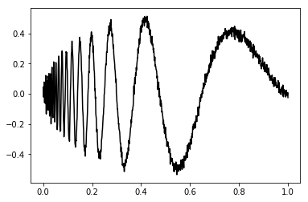
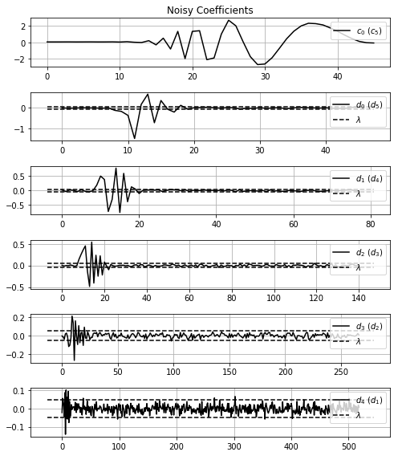

# Statistical Processing: A Python Statistical Signal Processing Package

A package that construct an interface for filtering wavelet coefficients (using PyWavelets) with statistical methods
## Getting started

First you can import some modules like:
``` python
    import pywt
    import numpy as np

    import statsWaveletFilt.filtration as fil
    import statsWaveletFilt.signals as sig
    import statsWaveletFilt.miscellaneous as misc
```
And follow some steps to make your filtrations:

### First step: Signal modelling

In many test for filtration and/or estimation of error, showed in articles, are supose an known ideal signal, how show the code above:
``` python
    import matplotlib.pyplot as plt

    dimension = 1024

    t, idealSignal = sig.dopplerFunction(dimension)
    plt.plot(t, idealSignal, 'k-')
    plt.show()
```


This package also gives a support for anothers three ideal signal: the **heavsine** (``sig.heavsineFunction()``), **bump** (``sig.bumpFunction()``) and **block** (``sig.blockFunction()``).

And add to this a kind of noise, generally *gaussian* or, also called, *normal*.
``` python
    noise = np.random.normal(0, .02, size=dimension)
    noisySignal = idealSignal + noise

    plt.plot(t, noisySignal, 'k-')
    plt.show()
```


### Second step: Wavelet transformation

Let's do this using the ``pywt.wavedec`` function. With this you can 1) make a wavelet transform of your noisy signal, 2) choice wich wavelet function is used (``'haar', 'db', 'gaus', 'mexh'`` among others) and 3) choice any levels you want to evaluate the transform.
``` python
    noisyCoeff = pywt.wavedec(noisySignal, 'db8', level=5)
```
The first position ``= noiseCoeff[0]`` has the scale coefficents of the last nível. The consecutive elements `` = noiseCoeff[1:]`` has the wavelet coefficients of the last to the first level of transform.

Using ``misc.showWaveletCoeff`` function you can show all coefficients returned of the transform.

``` python
    misc.showWaveletCoeff(noisyCoeff, title='Noisy Coefficients')
```


### Thirth step: Filtration

With the ``fil.filtration`` function you can put yours 1) coefficients for filtration, 2) choice the method (``'visu', 'sure', 'bayes', 'spc'``) and, if necessary, 3) set method own parameters (more details in documentation).
``` python
    filtrateCoeff, limiars = fil.filtration(noisyCoeff, method='visu')
```
And, again, you can show the wavelet coefficients before and after the filtration, with the limiar used using the ``misc.showWaveletCoeff`` function.

``` python
    misc.showWaveletCoeff(noisyCoeff, threshold_value=limiars, title='Noisy Coefficients')
    print('==============================================================')
    misc.showWaveletCoeff(filtrateCoeff, threshold_value=limiars, title='Filtered Coefficients')
```



### Fourth step: Recovery wavelet transformation

Using the ``pywt.waverec`` function we can revovery the signal.

``` python
    filtratedSignal = pywt.waverec(filtrateCoeff, 'db8')

    plt.plot(t, filtrateSignal, 'k-')
    plt.show()
```


### Fifth step: Figures of merith
Using ``sig.differential_snr_dB`` we can avaliate the filtration using some figures of merith of different forms of evaluate the snr or cnr (see more in Documentation) of the signal.
``` python
    sig.differential_snr_dB(noisySignal, filtratedSignal, method='variances', idealSignal=idealSignal)
```
### Appendix: Miscelaneous

* The ``misc.generateData`` function generate data using the signals showed here with different variances of noise and save in format ``.npy``.
* The ``misc.normalizeData`` function normalize a data between a min and max value, this function is used in all signals modeled in sig module.

### References

* [DONOHO, JOHNSTONE (1992), Ideal Spatial Adaptation by Wavelet Shrinkage](http://statweb.stanford.edu/~imj/WEBLIST/1994/isaws.pdf)
* [DONOHO, JOHNSTONE (1994), Adapting to Unknown Smoothness via Wavelet Shrinkage](http://statweb.stanford.edu/~imj/WEBLIST/1995/ausws.pdf)
* [CHANG, YU, VETTERLI (2000),Adaptive Wavelet Thresholding for Image Denoisingand Compression](https://core.ac.uk/download/pdf/147900624.pdf)
* [BAYER, KOZAKEVICIUS (2010), SPC-Threshold: Uma Proposta de Limiarização para Filtragem Adaptativa de Sinais](https://tema.sbmac.org.br/tema/article/download/96/43)
* [KOZAKEVICIUS, BAYER (2014), Filtragem de sinais via limiarização de coeficientes wavelet](http://oaji.net/articles/2017/1602-1487163088.pdf)
